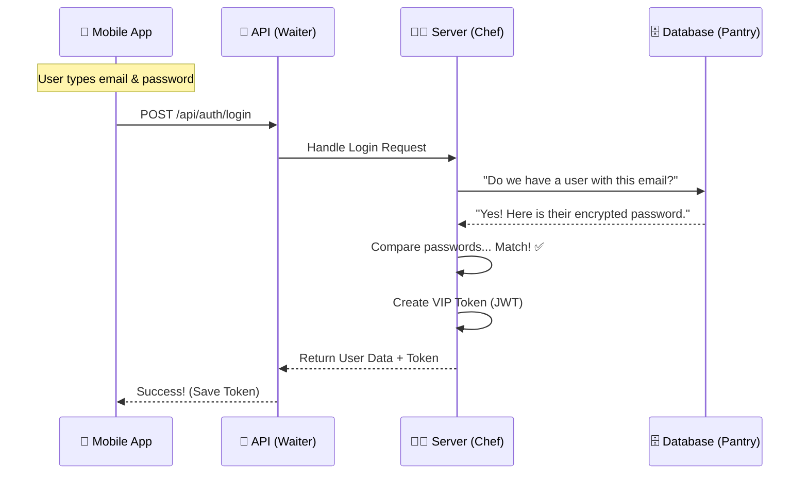

# How the Backend Works: A Beginner's Guide

Welcome! If you've ever wondered what happens "behind the scenes" when you click a button in your app, this guide is for you. We'll break down the backend of your Car Detailing App into simple, easy-to-understand concepts.

---

## 1. The Big Picture

Think of your application as two separate worlds talking to each other:
1.  **The Frontend (Mobile App):** This is what you see and touch. It lives on your phone.
2.  **The Backend (Server & Database):** This is the "brain" and "memory" of the app. It lives on a computer far away (or in the cloud).

When you open your app, it doesn't have all the data (like detailer profiles or your past bookings) stored inside it. It has to **ask** the backend for that information.

---

## 2. The "Restaurant Kitchen" Analogy

The best way to understand the backend is to imagine a restaurant.

### 🎭 The Roles

| App Component | Restaurant Analogy | Role |
| :--- | :--- | :--- |
| **Frontend (Mobile App)** | **The Customer** | Decides what they want (e.g., "I want to see my bookings") and tells the waiter. |
| **API (Application Programming Interface)** | **The Waiter** | Takes the order from the customer, brings it to the kitchen, and brings the food (data) back. It knows exactly what is on the menu. |
| **Server (Node.js/Express)** | **The Chef** | Receives the order ticket, does the work (chopping, cooking), and prepares the dish. It follows recipes (code logic). |
| **Database (PostgreSQL)** | **The Pantry / Fridge** | Stores all the raw ingredients (user data, bookings, passwords). The Chef goes here to get what they need. |

---

## 3. How It Works in Your App

Let's trace what happens when you **Log In** to the app.

### Step 1: The Request (Placing the Order)
You type your email and password and hit "Login".
The Mobile App (Customer) sends a message to the API (Waiter):
> *"Hey, here are my credentials. Can I come in?"*

### Step 2: The Logic (The Chef Cooks)
The Server (Chef) receives this message. It runs a specific function (recipe) called `login`:
1.  It checks if the email exists.
2.  It compares the password you sent with the one stored in the Pantry (Database).

### Step 3: The Database (The Pantry)
The Server asks the Database:
> *"Find me the user with email 'alex@example.com'."*

The Database looks through its rows and columns (like a giant Excel sheet) and hands the data back to the Server.

### Step 4: The Response (Serving the Dish)
If the password matches, the Server creates a **Token** (think of this as a VIP wristband).
It gives this Token to the API (Waiter), who brings it back to your Mobile App.

> *"Here is your VIP wristband (Token). Keep this safe! You'll need to show it every time you want to see private data."*

---

## 4. Visualizing the Flow

Here is exactly how data moves when a user tries to log in.

---

## 5. Key Components in Your Project

Now that you know the concepts, here is where they live in your actual code folders:

### 📂 `backend/server.js` (The Kitchen Manager)
This is the main entry point. It starts the kitchen, turns on the lights, and assigns Waiters (Routes) to tables.

### 📂 `backend/routes/` (The Menu)
This defines what the "Waiter" can do.
- `authRoutes.js`: Login, Register.
- `bookingRoutes.js`: Create booking, Cancel booking.
- If it's not in the routes, the Waiter can't do it!

### 📂 `backend/controllers/` (The Recipes)
This is what the Chef actually does.
- `authController.js`: Contains the logic for *how* to log someone in.
- `bookingController.js`: Contains the logic for *how* to save a new booking.

### 📂 `backend/schema.sql` (The Pantry Layout)
This defines how the Database is organized.
- `CREATE TABLE users`: "We have a shelf for Users."
- `CREATE TABLE bookings`: "We have a shelf for Bookings."

---

## 6. What is that "Token"? (The VIP Pass)

You noticed the app "automatically logs in". That's thanks to the **Token**.

1.  **Login:** You get a Token (a long string of random characters).
2.  **Storage:** The app saves this Token in a secure vault on your phone (`SecureStore`).
3.  **Next Visit:** When you open the app again, it checks the vault.
    - **Token found?** It sends it to the server: *"I have a wristband!"* -> Server says *"Come on in!"*
    - **No Token?** You have to log in again.

This is why you don't have to type your password every time!

---

## Summary

- **Frontend** = What you see.
- **Backend** = The logic and data.
- **API** = The messenger between them.
- **Database** = The storage cabinet.

You are building a full-stack application, which means you are the Architect, the Chef, and the Manager of this entire restaurant! 🚀
